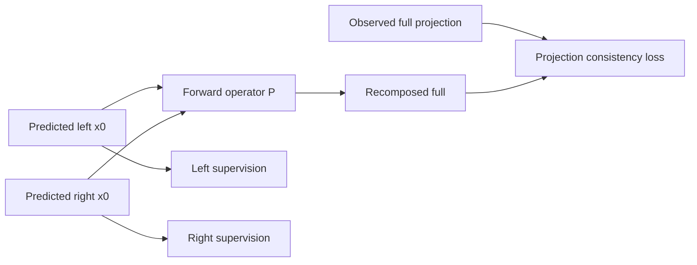

# Designing a Generative Pipeline to Decouple a Full Projection into Left and Right Projections

## Executive summary

Your task is best framed as a **paired conditional inverse problem with internal structure**, not as a generic image-to-image translation task. A “full” lateral projection contains **superimposed left/right anatomical contributions**, so the model should not only match `left` and `right` individually, but should also satisfy a **forward consistency relation** back to the observed `full` image. That idea is strongly aligned with both modern controllable generation work such as **ControlNet++**, which explicitly improves condition consistency, and diffusion-based inverse-problem methods such as **DPS**, **MPGD**, **DDNM**, and **DiffStateGrad**, which enforce measurement consistency during sampling. citeturn22search23turn22search11turn33search0turn21search0turn10search2turn20search2turn10search0

For your current regime—**limited data, from-scratch training, ~67M U-Net, radiograph-like grayscale images, and moderate resolution not explicitly specified**—the most practical choice is still **pixel-space conditional diffusion**, not latent diffusion, as the first serious implementation. SR3 and Palette remain the strongest conceptual baselines because they are simple, robust, and naturally operate where your supervision and physics constraints live. Latent diffusion becomes attractive only if memory or resolution is the bottleneck, or if you have a **domain-matched VAE / pretrained backbone** that does not destroy subtle superimposed edges. citeturn36search1turn35search0turn37search0turn37search1turn31search0turn12search2

Among the three variants you asked to implement, my recommendation is:

- **Best one-pass joint model:** **Late-decoder-branch**  
- **Best chance of recovering single-side quality:** **Side-conditional single-output**  
- **Best pure baseline / reference point:** **Original single-decoder out\_channel=2**  

If your priority is “**input full, output left and right in one run**,” implement **Variant B** first. If your priority is “**push SSIM as high as possible even if inference needs two conditioned passes**,” implement **Variant C** first. In either case, add a **projection-consistency loss during training**, and later a **consistency-guided sampling correction** during DDIM/PLMS inference. citeturn28search1turn33search0turn21search0turn10search2turn10search0

Modern alternatives such as **flow matching / rectified flow** are promising for faster sampling and cleaner transport, and are already being used in image generation and restoration, but for a small-data, from-scratch medical-style project they are better treated as a **second-phase optimization**, not the first architecture jump. Likewise, **JiT / transformer-first large-scale pixel generative models** are interesting, but they are far closer to large-scale high-compute regimes than to your current U-Net-based setting. citeturn34search0turn18academia1turn18academia0turn6search1

## Problem formulation and assumptions

I will assume only the following, because resolution, dataset size, and acquisition details were left unspecified: you have **paired tuples** `(full, left, right)`, images are **2D grayscale projections**, and `left` / `right` are intended to represent the two decomposed sides hidden inside the superimposed `full` image. These assumptions are important because the architecture and the forward constraint depend on whether `left/right` are true physical projections, reconstructed sub-projections, or annotation-based decompositions.

In lateral cephalometric-style imaging, left and right structures are literally **superimposed** in the observed radiograph. That means the relation among `full`, `left`, and `right` is not purely semantic; it is structural and partially physical. In other words, your advisor’s idea to constrain the generated `left/right` so they remain compatible with the observed `full` projection is exactly the right direction. citeturn22search23turn22search11

A critical detail is the **image domain** used for the consistency loss. Under Beer–Lambert physics, X-ray transmission follows  
$$
I = I_0 \exp\left(-\int \mu(s)\,ds\right),
$$
so **line integrals add in attenuation / log-transformed space**, not necessarily in raw intensity space. If your stored images are already approximately proportional to attenuation, a simple additive forward operator is reasonable. If they are raw detector intensities or heavily post-processed display images, you should either transform them into an attenuation-like domain first, or fit a small calibrated forward operator \(P\). citeturn23search0turn23search8turn23search10

Your uploaded U-Net already has the right structural ingredients for this project: a shared encoder–decoder path, timestep embedding, optional side embedding added into the temporal embedding path, and a single final output projection. That makes all three variants below incremental modifications rather than total rewrites. fileciteturn0file0

## Model family choice

Pixel-space diffusion is the strongest first choice for your task because the condition (`full`) and the targets (`left`, `right`) are spatially aligned and because your most important extra constraint—projection consistency—also lives naturally in pixel or log-attenuation space. SR3 showed that conditional diffusion works well for super-resolution via iterative refinement, and Palette showed that this same design extends cleanly to general image-to-image translation tasks without heavy task-specific engineering. citeturn36search1turn35search0

Latent diffusion is powerful when compute is the bottleneck. LDM explicitly reduces cost by doing diffusion in the latent space of a pretrained autoencoder while preserving strong generative quality, and that design underlies many practical controllable systems. In medical imaging, latent diffusion has also proven viable: Medfusion used a conditional latent DDPM for medical image synthesis, and MAISI / MONAI tooling show that latent diffusion is already a standard path for large medical volumes. The tradeoff is that latent diffusion adds a **Stage-1 autoencoder bottleneck**, which can blur or discard exactly the high-frequency superimposed details that matter in your decomposition task. citeturn37search0turn37search1turn31search0turn12search2turn12search4

ControlNet-style conditioning is extremely useful when you already have a strong pretrained diffusion backbone. ControlNet’s main insight is to **freeze the backbone** and learn condition-specific control through lightweight trainable paths; importantly, the paper reports robust training on both small and large datasets. ControlNet++ goes one step further and shows that **explicit consistency feedback** between the input condition and the generated output materially improves controllability. That consistency-feedback idea transfers directly to your task, but the full ControlNet strategy only becomes attractive if you are adapting a strong pretrained latent model rather than training from scratch. citeturn16search3turn33search0

Flow matching and rectified flow are worth reading now, but not worth *starting from* in your current setting. Rectified Flow and later restoration-oriented flow work show that transport-style training can yield high quality with very few sampling steps, and probability-flow samplers for restoration can improve both speed and consistency. Still, for a limited-data U-Net project with unresolved structural coupling, the safer path is: **first solve decomposition with diffusion + consistency**, then consider switching the same design to a flow objective if inference speed becomes the bottleneck. citeturn34search0turn18academia1turn18academia0

### Pixel-space vs latent-space diffusion for your task

| Choice | Strengths for full→left/right decoupling | Main risks | Compute / data profile | My recommendation |
|---|---|---|---|---|
| **Pixel-space diffusion** | Best geometric fidelity; easiest to impose `P(left,right)≈full`; simplest implementation from your current SR3/Palette-style code | More memory and slower sampling | Best at moderate resolution; no extra VAE stage | **Start here** |
| **Latent diffusion** | Lower memory; faster training/sampling; easiest path to pretrained ControlNet-style adaptation | VAE may erase subtle superimposed boundaries; harder to make physics loss exact | Two-stage training or need pretrained VAE | Use only if resolution/VRAM forces it |
| **Latent diffusion + pretrained VAE/backbone** | Most leverage from outside pretraining | Strong domain mismatch risk if backbone is natural-image or unrelated medical modality | Good when pretrained radiograph-like latent model exists | Worth exploring later, not first |

### Practicality of modern frameworks for your regime

| Framework | Practicality now | Why |
|---|---|---|
| **SR3 / Palette-style conditional diffusion** | **High** | Direct extension of what you already run |
| **Branched / multi-head diffusion** | **High** | Most targeted architectural fix for left/right interference |
| **Side-conditional single-output diffusion** | **High** | Easiest way to recover single-side quality |
| **ControlNet-style adapters** | **Medium** | Great if a strong pretrained latent model exists |
| **Latent diffusion from scratch** | **Medium–Low** | Useful mainly if memory bound |
| **Flow matching / rectified flow** | **Medium** | Good second-phase upgrade for speed |
| **Consistency models / progressive distillation** | **Medium** | Good after you already have a strong teacher model |
| **JiT / large transformer-first models** | **Low** | Too experimental / data-hungry for this setting |

## Implementable architectures

These three variants are all natural modifications of your current U-Net abstraction: shared input blocks, middle block, shared decoder, optional side embedding, and final output projection. fileciteturn0file0

### Original single-decoder out\_channel=2 baseline

```mermaid
flowchart LR
    F[Full projection condition] --> C[Concatenate with noisy pair state]
    X[Noisy pair x_t = [x_t^L, x_t^R]] --> C
    T[Timestep embedding] --> U
    C --> E[Shared Encoder]
    E --> M[Middle / Bottleneck]
    M --> D[Shared Decoder]
    D --> H[Single 2-channel output head]
    H --> O[[eps_L, eps_R or x0_L, x0_R]]
    U[UNet residual/attention blocks] --- E
    U --- M
    U --- D
```

### Late-decoder-branch

```mermaid
flowchart LR
    F[Full projection condition] --> C[Concatenate with noisy pair state]
    X[Noisy pair x_t = [x_t^L, x_t^R]] --> C
    T[Timestep embedding] --> U
    C --> E[Shared Encoder]
    E --> M[Middle / Bottleneck]
    M --> D0[Shared Coarse Decoder]
    D0 --> DL[Left late decoder branch]
    D0 --> DR[Right late decoder branch]
    DL --> HL[Left output head]
    DR --> HR[Right output head]
    HL --> OL[[eps_L or x0_L]]
    HR --> OR[[eps_R or x0_R]]
    U[UNet residual/attention blocks] --- E
    U --- M
    U --- D0
    U --- DL
    U --- DR
```

### Recommended implementation table

| Variant | Approx. parameters | Expected benefit | Main risk | Training recipe | Inference behavior |
|---|---:|---|---|---|---|
| **A. Original single-decoder out\_channel=2** | **≈67M** | Simplest one-pass paired generator; best control baseline | Left/right interference in the shared late decoder and final head | Diffusion loss on paired target + light projection consistency (`λ_proj` small at start) | One diffusion run returns both left/right |
| **B. Late-decoder-branch** | **≈80–95M** depending on whether you duplicate the last 1 or last 2 upsample stages | Best compromise between shared global anatomy and side-specific detail reconstruction | More memory; skip-handling becomes more delicate | Diffusion loss on pair + stronger projection consistency + edge loss; this is my **default recommendation** | One diffusion run returns both left/right |
| **C. Side-conditional single-output** | **≈67–68M** | Highest chance of matching your current single-side SSIM because each prediction is a single task | Need two conditioned passes to get both outputs; joint coupling must be added by loss/guidance | Diffusion loss on one side at a time, conditioned by side label; optionally pair left/right from same full within batch for consistency | Run twice with same `full`, once with `side=left`, once with `side=right`; can be batched together |

My recommendation is **B first, C second**. Variant B directly addresses the most likely failure mode of your current joint model: too much shared high-resolution decoding. Variant C is the fallback if the project prioritizes absolute side quality over one-pass inference.

## Losses and sampling-time guidance

The core training objective should remain a standard diffusion denoising loss, but now on either the **paired state** $[L,R]$ or a **single side** $S\in\{L,R\}$, together with explicit forward consistency. This follows the classical diffusion formulation from DDPM / Improved DDPM / Score-SDE while borrowing the *consistency* idea from ControlNet++ and inverse-problem diffusion work. 

Let the clean target be either

$$z_0=[l_0,r_0]$$
$$\quad\text{or}\quad
z_0=s_0 \in \{l_0,r_0\},
$$
and the noised target at timestep $t$ be

$$
z_t = \sqrt{\bar\alpha_t}\, z_0 + \sqrt{1-\bar\alpha_t}\,\epsilon,\qquad \epsilon\sim\mathcal N(0,I).
$$

If you use $\epsilon$-prediction, the basic loss is
$$
\mathcal L_{\text{diff}}
=
\mathbb E_{z_0,\epsilon,t}
\left[
\left\|
\epsilon - \epsilon_\theta(z_t,\;c,\;t)
\right\|_2^2
\right],
$$
where $c$is the conditioning input. For Variant C, write \(c=(\text{full}, \text{side})\). For Variants A/B, write \(c=\text{full}\).

The predicted clean state is
$$
\hat z_0
=
\frac{z_t - \sqrt{1-\bar\alpha_t}\,\hat\epsilon_\theta}{\sqrt{\bar\alpha_t}}.
$$

### Projection-consistency loss

Define an optional image transform $A(\cdot)$ that maps images into an attenuation-like / log domain if appropriate, and a forward operator $P$ that recomposes left/right into the measured full projection. Then
$$
\mathcal L_{\text{proj}}
=
\left\|
P\!\left(A(\hat l_0),A(\hat r_0)\right) - A(y_{\text{full}})
\right\|_1.
$$

A good first operator is
$$
P(a,b)=\alpha a+\beta b+\gamma,
$$
with \(\alpha,\beta,\gamma\) fitted from training data. If that is too crude, use a tiny frozen calibrator \(P_\phi\) trained separately on `(left,right)->full` with heavy regularization.

### Structural losses

Use structure-aware auxiliary losses only after the diffusion objective is already stable.

$$
\mathcal L_{\text{edge}}
=
\|\nabla \hat l_0-\nabla l_0\|_1
+
\|\nabla \hat r_0-\nabla r_0\|_1
$$

$$
\mathcal L_{\text{perc}}
=
\|\phi(\hat l_0)-\phi(l_0)\|_1
+
\|\phi(\hat r_0)-\phi(r_0)\|_1
$$
where \(\phi\) can be LPIPS-style features or, preferably, a radiograph-domain encoder if you have one. LPIPS is useful, but for medical projection tasks I would keep it optional and weak. citeturn19search1turn29search13

If you want uncertainty maps, the easiest approach is **not** to train an uncertainty head at first. Instead, draw \(K\) samples and compute variance maps:
$$
U_l(p)=\mathrm{Var}_{k=1}^K[\hat l_0^{(k)}(p)],\qquad
U_r(p)=\mathrm{Var}_{k=1}^K[\hat r_0^{(k)}(p)].
$$
That is simple, faithful to diffusion’s stochasticity, and immediately useful for error localization.

### Recommended total objective and weights

I recommend
$$
\mathcal L
=
\mathcal L_{\text{diff}}
+
\lambda_{\text{proj}}\mathcal L_{\text{proj}}
+
\lambda_{\text{edge}}\mathcal L_{\text{edge}}
+
\lambda_{\text{perc}}\mathcal L_{\text{perc}}.
$$

A good starting point, assuming images normalized to $[-1,1]$, is:

- $\lambda_{\text{proj}} = 0.05$ for the first stable run, then tune in the range **0.05–0.20**
- $\lambda_{\text{edge}} = 0.02$ to **0.10**
- $\lambda_{\text{perc}} = 0$ initially, then **0.005–0.02** only if visual sharpness lags behind SSIM

A practical rule is: **during the first 10–20k stable steps, all auxiliary losses together should contribute less than about 20–30% of the diffusion loss magnitude**.

### Projection-consistency concept



### Sampling-time guidance options

The most relevant sampling-time trick for your project is **consistency guidance**, not CFG or attention guidance.

- **CFG** is useful only if you deliberately train with conditioning dropout and want stronger conditional adherence.
- **Consistency / energy guidance** is directly aligned with your physics constraint.
- **SAG / PAG / energy-style attention guidance** can improve perceived structure, but they do not solve anatomical left/right identity by themselves. citeturn39academia10turn21search0turn10search2turn10search0turn38search2turn32search1turn38search1

A good energy for sampling guidance is
$$
E_{\text{proj}}(x_t)
=
\lambda_g
\left\|
P\!\left(A(\hat l_0(x_t)),A(\hat r_0(x_t))\right)-A(y_{\text{full}})
\right\|_2^2.
$$

Then at each DDIM/PLMS step you apply a small gradient correction.

### Pseudocode for consistency guidance during DDIM / PLMS

```python
# x_t: current noisy latent/state
# full: observed full projection
# model: diffusion UNet
# pred_x0(): convert eps prediction to x0 prediction
# P(): forward operator for recomposing left/right -> full
# A(): optional log/attenuation transform

for t in timesteps:
    eps_hat = model(x_t, cond=full, t=t)          # joint model: predicts both channels
    x0_hat  = pred_x0(x_t, eps_hat, t)

    left_hat, right_hat = split_channels(x0_hat)

    energy = lambda_g * mse(
        P(A(left_hat), A(right_hat)),
        A(full)
    )

    g = grad(energy, x_t)                         # backprop through x0_hat and P
    g = g / (norm(g) + 1e-8)

    # small projection step; apply only in later timesteps if early guidance is unstable
    x_t = x_t - eta_t * g

    # standard DDIM / PLMS update
    x_t = ddim_or_plms_update(model, x_t, cond=full, t=t)
```

Practical notes:

- Start with **one** gradient step per denoising step.
- Apply guidance only in the **later half** of timesteps first.
- Keep $\eta_t$ small, and decrease it as $t\to 0$.
- For Variant C, sample `left` and `right` **in the same batch at the same timestep** so the energy can see a matched pair.

## Training, inference, and evaluation

Modern diffusion practice gives you several highly practical improvements without changing the essence of the model: **Improved DDPM** for better variance / schedules, **EDM** for cleaner design and preconditioning, **DDIM** and **DPM-Solver++** for fewer inference steps, and later **progressive distillation / consistency models** if you want very fast sampling from a good teacher. These are practical; they are not experimental luxuries. citeturn27search0turn26search0turn15search1turn15search0turn13search14turn4search15

### Training recipe

For all three variants, I would start with:

- **Optimizer:** `AdamW`
- **LR peak:** `5e-5`
- **Betas:** `(0.9, 0.99)`
- **Weight decay:** `1e-2` or lower; if instability appears, reduce before lowering LR
- **EMA:** `0.999` to `0.9999`
- **Mixed precision:** yes
- **Gradient clipping:** `1.0`
- **Effective batch size:** aim for **8–16** via accumulation if needed

For your specific history of slow convergence and scheduler shock, I would *not* return to a pure cosine-from-step-0 schedule. Use a **warmup + flat + staged decay** schedule instead. A concrete example for a 300k-step run:

- `0–5k`: warm up linearly to `5e-5`
- `5k–120k`: hold `5e-5`
- `120k–240k`: `3e-5`
- `240k–300k`: `1e-5`

That schedule fits long conditional-diffusion training much better than a continuously decaying cosine when optimization is still clearly in the “feature formation” phase.

### Resume / checkpoint strategy

When resuming, **restore optimizer and scheduler state exactly** whenever possible. If you must change scheduler mid-run, do **not** jump the LR upward after a long cosine decay; that is a classic recipe for the oscillation you observed. Instead:

1. Load the checkpoint
2. Read the current effective LR
3. Restart with the **same or lower LR**
4. Optionally use a **micro-warmup** over 500–2000 steps

That avoids optimization shock.

### U-Net forward modification for the late-branch model

The essential implementation detail is simple: **share all low-resolution features, split only high-resolution decoding**. With your current U-Net abstraction, that means:

1. Keep `input_blocks` shared  
2. Keep `middle_block` shared  
3. Keep early `output_blocks` shared  
4. Duplicate only the last one or two high-resolution output stages into `output_blocks_left` and `output_blocks_right`  
5. After the split, each branch needs its **own copy of the remaining skip stack**

A minimal pseudocode sketch is:

```python
hs = []
h = stem(x)
for block in input_blocks:
    h = block(h, emb)
    hs.append(h)

h = middle_block(h, emb)

for block in shared_output_blocks:
    h = block(cat(h, hs.pop()), emb)

hs_left  = list(hs)
hs_right = list(hs)

h_left, h_right = h, h
for block in output_blocks_left:
    h_left = block(cat(h_left, hs_left.pop()), emb)

for block in output_blocks_right:
    h_right = block(cat(h_right, hs_right.pop()), emb)

out_left  = out_head_left(h_left)
out_right = out_head_right(h_right)
```

This is the cleanest way to branch from your existing codebase. fileciteturn0file0

### Inference behavior by variant

- **Variant A:** one diffusion run, output `[left,right]`
- **Variant B:** one diffusion run, output `left` and `right` from separate late branches
- **Variant C:** same `full`, run twice with `side=left` and `side=right`; batch those two calls together if possible

For initial inference, use **DDIM or DPM-Solver++ with ~20–30 steps**. If quality is stable, try **15–20 steps**. I would only pursue distillation or full consistency-model conversion after the decomposition itself is working. citeturn15search1turn15search0turn13search14turn4search15

### Augmentation caveat

Horizontal flipping is not neutral in your problem. It changes side identity. If you use flip augmentation:

- For **A/B**, flip `full` and also **swap** `left` and `right`
- For **C**, flip the target image and also flip the side label

That one detail can materially affect disentanglement quality.

### Evaluation metrics

For this project, I would report four categories of metrics:

1. **Per-side fidelity**
   - SSIM$_L$, SSIM$_R$
   - PSNR$_L$, PSNR$_R$

2. **Projection consistency**
   - $\|P(\hat L,\hat R)-F\|_1$
   - SSIM / PSNR between recomposed full and observed full

3. **Structure-aware fidelity**
   - gradient MAE / edge loss on left and right
   - optional LPIPS if visual realism matters

4. **Uncertainty / diversity**
   - sample variance maps
   - variance-weighted error (high uncertainty on failure regions is better than confident hallucination)

Diffusion-for-restoration surveys consistently emphasize that exact distortion metrics and perceptual metrics should be reported together; for your task, add **projection consistency** as a first-class metric because it captures the actual decomposition constraint. citeturn17search1turn19search1

If anatomical landmarks are available, add a downstream metric such as **landmark localization error on generated left/right**. That is often more meaningful than a small gain in SSIM.

## Reading list

The first six are the ones I would read in full before implementing the next version.

- **Must-read — SR3: Image Super-Resolution via Iterative Refinement**. The cleanest starting point for conditional diffusion in pixel space. citeturn36search1
- **Must-read — Palette: Image-to-Image Diffusion Models**. The most relevant generic formulation for conditional image-to-image translation with a diffusion U-Net. citeturn35search0
- **Must-read — High-Resolution Image Synthesis with Latent Diffusion Models**. The canonical latent-space alternative and the basis of most pretrained controllable systems. citeturn37search0turn37search1
- **Must-read — Adding Conditional Control to Text-to-Image Diffusion Models**. Read this to understand when ControlNet-style adapters are worth the complexity. citeturn16search3
- **Must-read — Hierarchically Branched Diffusion Models Leverage Dataset Structure for Class-Conditional Generation**. Not your exact setting, but the clearest conceptual precedent for branching the reverse process. citeturn28search1
- **Must-read — Diffusion Posterior Sampling for General Noisy Inverse Problems**. The best conceptual bridge from standard diffusion to your projection-consistency-guided sampling idea. citeturn21search0

Additional highly relevant papers:

- **ControlNet++: Improving Conditional Controls with Efficient Consistency Feedback** — explicit condition-consistency optimization; very relevant to your loss design. citeturn33search0
- **Manifold Preserving Guided Diffusion** — practical training-free guidance for inverse problems and constraint satisfaction. citeturn10search2
- **Diffusion State-Guided Projected Gradient for Inverse Problems** — useful for more stable measurement/projection guidance during sampling. citeturn10search0
- **Zero-Shot Image Restoration Using Denoising Diffusion Null-Space Model** — strong intuition for enforcing data consistency while preserving realism. citeturn20search2
- **Score-Based Generative Modeling through Stochastic Differential Equations** — the continuous-time score framework behind many guidance / inverse-problem formulations. citeturn40search0
- **Elucidating the Design Space of Diffusion-Based Generative Models** — practical training/sampling design choices that remain highly relevant. citeturn26search0
- **Improved Denoising Diffusion Probabilistic Models** — scheduling and variance-learning improvements. citeturn27search0
- **Denoising Diffusion Implicit Models** — essential for practical fast inference. citeturn15search1
- **DPM-Solver++** — the most practical fast guided sampler to try after DDIM. citeturn15search0
- **Progressive Distillation for Fast Sampling of Diffusion Models** — useful after you already have a good teacher. citeturn13search14
- **Consistency Models** — useful if you later want very few-step inference. citeturn4search15
- **Flow Straight and Fast: Learning to Generate and Transfer Data with Rectified Flow** — the main rectified-flow / flow-matching conceptual paper. citeturn34search0
- **Efficient Conditional Diffusion Model with Probability Flow Sampling for Image Super-Resolution** — restoration-oriented flow/probability-flow design. citeturn18academia1
- **Reversing Flow for Image Restoration** — interesting for future few-step restoration pipelines. citeturn18academia0
- **Self-Rectifying Diffusion Sampling with Perturbed-Attention Guidance** and **Self-Attention Guidance** — optional inference-time structure refinement. citeturn32search1turn38search2
- **Transfer Learning for Diffusion Models** and **Fine-tuning Diffusion Models with Limited Data** — useful if you later move toward adaptation instead of from-scratch training. citeturn24search0turn25search1
- **Volumetric Conditioning Module to Control Pretrained Diffusion Models for 3D Medical Images** and **ProGiDiff** — evidence that ControlNet-style medical conditioning is becoming practical when a backbone already exists. citeturn16academia10turn16search0
- **A multimodal comparison of latent DDPMs for medical image synthesis** and **MAISI** — good references if you eventually move into medical latent diffusion tooling. citeturn31search0turn12search2
- **Back to Basics: Let Denoising Generative Models Denoise** — the JiT-style / pure pixel generative direction you mentioned; worth reading, but I would treat it as experimental for your current project. citeturn6search1

## Open questions and limitations

The largest unresolved issue is the exact form of the forward relation $P(left,right)\to full$. That depends on acquisition and preprocessing. If your stored image values are not in an attenuation-like domain, a naive `left + right ≈ full` loss may be physically wrong even if the project idea is correct. Verify this first with calibration plots or a shallow fitted forward model. citeturn23search0turn23search8turn23search10

A second open issue is whether your `left` and `right` labels are **physically derived decompositions** or merely **annotation-defined subtargets**. If they are annotation-defined, projection consistency is still useful, but the operator $P$ should be interpreted as a task-specific recomposition map rather than literal X-ray physics.

A third limitation is that compute and dataset size were unspecified. Because of that, parameter counts beyond your current reported ~67M are estimates, and the exact branch point for Variant B should be chosen after a small ablation: split only the last upsample stage first, then the last two if leakage remains.

Within those limits, the highest-confidence roadmap is:

1. **Implement Variant B or C**
2. **Add projection-consistency loss in the correct image domain**
3. **Stabilize training with a warmup + flat + staged-decay LR**
4. **Only then add sampling-time consistency guidance**
5. **Only after that consider latent diffusion or flow matching**