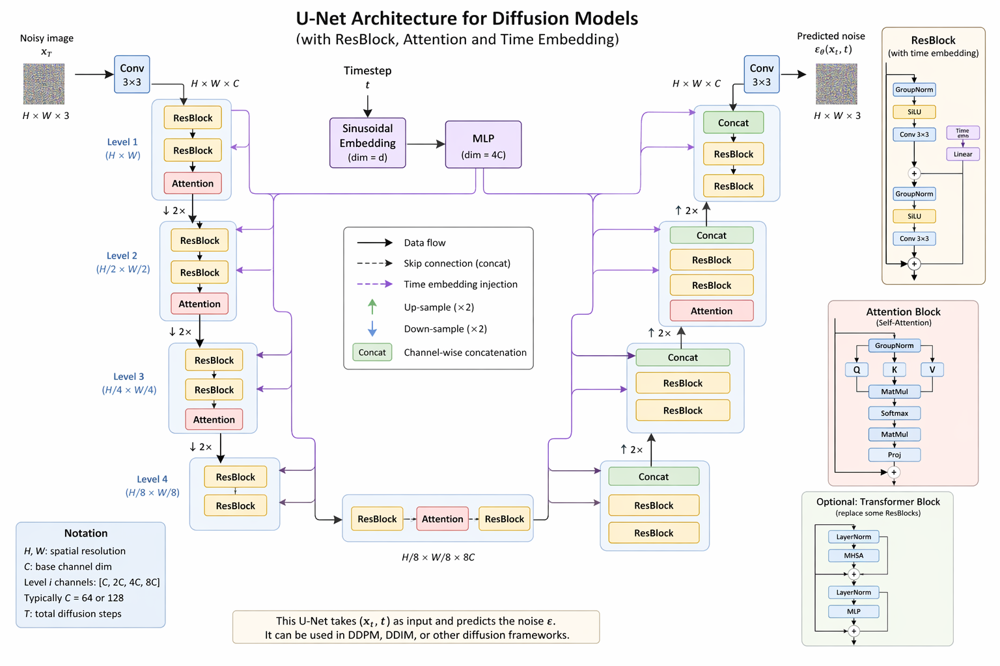

好。我们就按你说的顺序来：

1. **先亲手写一个基础版 diffusion U-Net**
2. **再把它升级成你那份更优雅的 conditional 版本**

   * time embedding
   * `EmbedSequential`
   * `scale-shift norm`
   * `side_emb`

我会尽量用“**先会写，再理解为什么这么写**”的方式讲。你看完应该能自己从 0 写出来。

---

# 一、先建立总图：你到底在写什么

我们要写的是一个去噪网络：

[
\epsilon_\theta(x_t, t)
]

输入：

* `x_t`: 加噪后的图像，shape `[B, C, H, W]`
* `t`: 当前时间步，shape `[B]`

输出：

* 预测噪声，shape 还是 `[B, C, H, W]`

最基础的 U-Net 结构就是：

```text
x_t
 ↓
input conv
 ↓
[Down Block 1]
 ↓
[Down Block 2]
 ↓
[Middle Block]
 ↓
[Up Block 2]  ← skip connection
 ↓
[Up Block 1]  ← skip connection
 ↓
out conv
 ↓
eps_pred
```

而 diffusion 和普通 U-Net 最大区别是：


## UNET Architechture 



> **每个 ResBlock 都要知道 t**

所以你会看到 `emb` 被一路传进去。

---

# 二、第一步：先写一个最基础版，不加 attention，不加 scale-shift

先把骨架跑通。

---

## 2.1 时间步 embedding

最基础的 diffusion 都会先把 `t` 变成一个向量。

### 写法

```python
import math
import torch
import torch.nn as nn
import torch.nn.functional as F
```

```python
def timestep_embedding(timesteps: torch.Tensor, dim: int) -> torch.Tensor:
    """
    timesteps: [B]
    return: [B, dim]
    """
    half = dim // 2
    device = timesteps.device

    freqs = torch.exp(
        -math.log(10000) * torch.arange(half, device=device).float() / half
    )
    args = timesteps.float().unsqueeze(1) * freqs.unsqueeze(0)

    emb = torch.cat([torch.sin(args), torch.cos(args)], dim=1)

    if dim % 2 == 1:
        emb = F.pad(emb, (0, 1))
    return emb
```

---

## 2.2 一个最简单激活函数

```python
class SiLU(nn.Module):
    def forward(self, x):
        return x * torch.sigmoid(x)
```

---

## 2.3 最基础的 ResBlock

先不搞 scale-shift，先写最朴素版本：

思路：

1. `x -> norm -> act -> conv`
2. time embedding 经过线性层投影成通道数
3. 直接加到 feature map 上
4. 再 `norm -> act -> conv`
5. 最后 residual 加回去

### 代码

```python
class ResBlock(nn.Module):
    def __init__(self, in_ch: int, out_ch: int, emb_ch: int):
        super().__init__()
        self.in_ch = in_ch
        self.out_ch = out_ch

        self.norm1 = nn.GroupNorm(32 if in_ch >= 32 else 1, in_ch)
        self.act1 = SiLU()
        self.conv1 = nn.Conv2d(in_ch, out_ch, kernel_size=3, padding=1)

        self.emb_proj = nn.Sequential(
            SiLU(),
            nn.Linear(emb_ch, out_ch)
        )

        self.norm2 = nn.GroupNorm(32 if out_ch >= 32 else 1, out_ch)
        self.act2 = SiLU()
        self.conv2 = nn.Conv2d(out_ch, out_ch, kernel_size=3, padding=1)

        if in_ch != out_ch:
            self.skip = nn.Conv2d(in_ch, out_ch, kernel_size=1)
        else:
            self.skip = nn.Identity()

    def forward(self, x: torch.Tensor, emb: torch.Tensor) -> torch.Tensor:
        h = self.conv1(self.act1(self.norm1(x)))

        emb_out = self.emb_proj(emb)[:, :, None, None]   # [B, out_ch, 1, 1]
        h = h + emb_out

        h = self.conv2(self.act2(self.norm2(h)))
        return h + self.skip(x)
```

---

## 2.4 下采样与上采样

```python
class Downsample(nn.Module):
    def __init__(self, ch: int):
        super().__init__()
        self.conv = nn.Conv2d(ch, ch, kernel_size=3, stride=2, padding=1)

    def forward(self, x):
        return self.conv(x)
```

```python
class Upsample(nn.Module):
    def __init__(self, ch: int):
        super().__init__()
        self.conv = nn.Conv2d(ch, ch, kernel_size=3, padding=1)

    def forward(self, x):
        x = F.interpolate(x, scale_factor=2, mode="nearest")
        return self.conv(x)
```

---

## 2.5 写一个最小版 U-Net

先做 2 层 down + 2 层 up，最容易看懂。

```python
class BasicUNet(nn.Module):
    def __init__(self, in_ch=3, base_ch=64, out_ch=3):
        super().__init__()

        emb_ch = base_ch * 4

        # time embedding
        self.time_mlp = nn.Sequential(
            nn.Linear(base_ch, emb_ch),
            SiLU(),
            nn.Linear(emb_ch, emb_ch),
        )

        self.in_conv = nn.Conv2d(in_ch, base_ch, kernel_size=3, padding=1)

        # down
        self.down1 = ResBlock(base_ch, base_ch, emb_ch)
        self.down2 = ResBlock(base_ch, base_ch * 2, emb_ch)
        self.downsample1 = Downsample(base_ch * 2)

        self.down3 = ResBlock(base_ch * 2, base_ch * 2, emb_ch)
        self.down4 = ResBlock(base_ch * 2, base_ch * 4, emb_ch)
        self.downsample2 = Downsample(base_ch * 4)

        # middle
        self.mid1 = ResBlock(base_ch * 4, base_ch * 4, emb_ch)
        self.mid2 = ResBlock(base_ch * 4, base_ch * 4, emb_ch)

        # up
        self.upsample1 = Upsample(base_ch * 4)
        self.up1 = ResBlock(base_ch * 4 + base_ch * 4, base_ch * 2, emb_ch)
        self.up2 = ResBlock(base_ch * 2 + base_ch * 2, base_ch * 2, emb_ch)

        self.upsample2 = Upsample(base_ch * 2)
        self.up3 = ResBlock(base_ch * 2 + base_ch * 2, base_ch, emb_ch)
        self.up4 = ResBlock(base_ch + base_ch, base_ch, emb_ch)

        self.out_norm = nn.GroupNorm(32 if base_ch >= 32 else 1, base_ch)
        self.out_act = SiLU()
        self.out_conv = nn.Conv2d(base_ch, out_ch, kernel_size=3, padding=1)

        self.base_ch = base_ch

    def forward(self, x: torch.Tensor, t: torch.Tensor) -> torch.Tensor:
        emb = timestep_embedding(t, self.base_ch)
        emb = self.time_mlp(emb)

        x = self.in_conv(x)

        # down
        h1 = self.down1(x, emb)
        h2 = self.down2(h1, emb)
        x = self.downsample1(h2)

        h3 = self.down3(x, emb)
        h4 = self.down4(h3, emb)
        x = self.downsample2(h4)

        # middle
        x = self.mid1(x, emb)
        x = self.mid2(x, emb)

        # up
        x = self.upsample1(x)
        x = torch.cat([x, h4], dim=1)
        x = self.up1(x, emb)

        x = torch.cat([x, h3], dim=1)
        x = self.up2(x, emb)

        x = self.upsample2(x)
        x = torch.cat([x, h2], dim=1)
        x = self.up3(x, emb)

        x = torch.cat([x, h1], dim=1)
        x = self.up4(x, emb)

        x = self.out_conv(self.out_act(self.out_norm(x)))
        return x
```

---

## 2.6 先确认你学会了什么

到这里，你已经写出了一个**基础版 diffusion U-Net**。
你应该已经掌握了：

### 结构上

* U-Net = down / middle / up
* skip connection = `torch.cat`

### diffusion 特有的点

* `t -> embedding -> MLP`
* 每个 `ResBlock` 都要吃 `emb`

---

# 三、第二步：把基础版升级为“更优雅的版本”

你给的代码之所以更优雅，关键有 4 个升级：

1. `EmbedBlock`
2. `EmbedSequential`
3. `scale-shift norm`
4. `side_emb`

我们一个个加。

---

# 四、升级 1：先做 EmbedBlock / EmbedSequential

这是代码工程上的优雅点。

问题是：
普通 `nn.Sequential` 只能传 `x`，不能方便地传 `(x, emb)`。

所以我们定义一种“知道 embedding 的模块”。

---

## 4.1 定义 EmbedBlock

```python
from abc import abstractmethod

class EmbedBlock(nn.Module):
    @abstractmethod
    def forward(self, x: torch.Tensor, emb: torch.Tensor) -> torch.Tensor:
        raise NotImplementedError
```

意思是：

> 任何继承 `EmbedBlock` 的层，都必须能处理 `(x, emb)`。

---

## 4.2 定义 EmbedSequential

```python
class EmbedSequential(nn.Sequential, EmbedBlock):
    def forward(self, x: torch.Tensor, emb: torch.Tensor) -> torch.Tensor:
        for layer in self:
            if isinstance(layer, EmbedBlock):
                x = layer(x, emb)
            else:
                x = layer(x)
        return x
```

### 它的作用

比如你写：

```python
block = EmbedSequential(
    ResBlock(...),
    AttentionBlock(...),
)
```

那么 forward 时：

* `ResBlock` 会收到 `(x, emb)`
* `AttentionBlock` 如果不是 `EmbedBlock`，就只收到 `x`

这就很优雅。

---

# 五、升级 2：把 ResBlock 改成 EmbedBlock

现在把你之前的 `ResBlock` 改成继承 `EmbedBlock`：

```python
class ResBlock(EmbedBlock):
    def __init__(self, in_ch: int, out_ch: int, emb_ch: int, dropout: float = 0.0):
        super().__init__()
        self.in_ch = in_ch
        self.out_ch = out_ch

        self.in_layers = nn.Sequential(
            nn.GroupNorm(32 if in_ch >= 32 else 1, in_ch),
            SiLU(),
            nn.Conv2d(in_ch, out_ch, 3, padding=1),
        )

        self.emb_layers = nn.Sequential(
            SiLU(),
            nn.Linear(emb_ch, out_ch),
        )

        self.out_layers = nn.Sequential(
            nn.GroupNorm(32 if out_ch >= 32 else 1, out_ch),
            SiLU(),
            nn.Dropout(dropout),
            nn.Conv2d(out_ch, out_ch, 3, padding=1),
        )

        if in_ch != out_ch:
            self.skip_connection = nn.Conv2d(in_ch, out_ch, 1)
        else:
            self.skip_connection = nn.Identity()

    def forward(self, x: torch.Tensor, emb: torch.Tensor) -> torch.Tensor:
        h = self.in_layers(x)

        emb_out = self.emb_layers(emb)
        while len(emb_out.shape) < len(h.shape):
            emb_out = emb_out[..., None]

        h = h + emb_out
        h = self.out_layers(h)
        return self.skip_connection(x) + h
```

注意这里已经很接近你给的版本了。

---

# 六、升级 3：加入 AttentionBlock

先写一个简单版 attention。这个不是最难的，先会用就行。

```python
class AttentionBlock(nn.Module):
    def __init__(self, channels: int, num_heads: int = 1):
        super().__init__()
        self.channels = channels
        self.num_heads = num_heads
        self.norm = nn.GroupNorm(32 if channels >= 32 else 1, channels)
        self.qkv = nn.Conv1d(channels, channels * 3, 1)
        self.proj_out = nn.Conv1d(channels, channels, 1)

    def forward(self, x: torch.Tensor) -> torch.Tensor:
        b, c, h, w = x.shape
        x_in = x

        x = x.reshape(b, c, h * w)
        x = self.norm(x)

        qkv = self.qkv(x)
        q, k, v = torch.chunk(qkv, 3, dim=1)

        head_dim = c // self.num_heads
        q = q.view(b, self.num_heads, head_dim, h * w)
        k = k.view(b, self.num_heads, head_dim, h * w)
        v = v.view(b, self.num_heads, head_dim, h * w)

        scale = head_dim ** -0.5
        attn = torch.einsum("bncl,bncs->bnls", q * scale, k * scale)
        attn = torch.softmax(attn, dim=-1)

        out = torch.einsum("bnls,bncs->bncl", attn, v)
        out = out.reshape(b, c, h * w)
        out = self.proj_out(out)
        out = out.reshape(b, c, h, w)

        return x_in + out
```

---

# 七、升级 4：真正关键的 scale-shift norm

这个是你最想学的重点。

---

## 7.1 先理解普通版本

普通 time injection 是：

[
h = h + \text{emb}
]

也就是只给一个 bias。

---

## 7.2 scale-shift 的想法

我们不只是加 bias，而是让 embedding 控制：

* `scale`
* `shift`

即：

[
h = \text{Norm}(h)\cdot (1 + \text{scale}) + \text{shift}
]

这个更强，因为它能控制：

* 特征放大/缩小
* 特征整体平移

这就是 FiLM / adaptive normalization 的思路。

---

## 7.3 如何在代码里实现

关键是：

### 普通时

`emb_proj` 输出 `out_ch`

### scale-shift 时

`emb_proj` 要输出 `2 * out_ch`

因为要拆成：

* 前一半：`scale`
* 后一半：`shift`

---

## 7.4 升级版 ResBlock

这是你要重点抄熟的版本：

```python
class ResBlock(EmbedBlock):
    def __init__(
        self,
        in_ch: int,
        out_ch: int,
        emb_ch: int,
        dropout: float = 0.0,
        use_scale_shift_norm: bool = False,
    ):
        super().__init__()
        self.in_ch = in_ch
        self.out_ch = out_ch
        self.use_scale_shift_norm = use_scale_shift_norm

        self.in_layers = nn.Sequential(
            nn.GroupNorm(32 if in_ch >= 32 else 1, in_ch),
            SiLU(),
            nn.Conv2d(in_ch, out_ch, 3, padding=1),
        )

        self.emb_layers = nn.Sequential(
            SiLU(),
            nn.Linear(
                emb_ch,
                2 * out_ch if use_scale_shift_norm else out_ch
            ),
        )

        self.out_norm = nn.GroupNorm(32 if out_ch >= 32 else 1, out_ch)
        self.out_rest = nn.Sequential(
            SiLU(),
            nn.Dropout(dropout),
            nn.Conv2d(out_ch, out_ch, 3, padding=1),
        )

        if in_ch != out_ch:
            self.skip_connection = nn.Conv2d(in_ch, out_ch, 1)
        else:
            self.skip_connection = nn.Identity()

    def forward(self, x: torch.Tensor, emb: torch.Tensor) -> torch.Tensor:
        h = self.in_layers(x)

        emb_out = self.emb_layers(emb)
        while len(emb_out.shape) < len(h.shape):
            emb_out = emb_out[..., None]

        if self.use_scale_shift_norm:
            scale, shift = torch.chunk(emb_out, 2, dim=1)
            h = self.out_norm(h) * (1 + scale) + shift
            h = self.out_rest(h)
        else:
            h = h + emb_out
            h = self.out_rest(self.out_norm(h))

        return self.skip_connection(x) + h
```

---

## 7.5 你要真正理解的点

这段代码里最核心的是：

```python
scale, shift = torch.chunk(emb_out, 2, dim=1)
h = self.out_norm(h) * (1 + scale) + shift
```

它不是简单“把时间 embedding 加进去”，而是：

> **让时间 embedding 直接调制当前 block 的 feature statistics**

所以这比 `h + emb` 更强。

---

# 八、升级 5：side_emb 是什么，怎么加

这个你给的代码里也有。

---

## 8.1 它是什么

`side_emb` 本质上是一个**额外的条件 embedding**，比如：

* 类别 label
* domain label
* 左右视角标签
* 退化类型标签
* 其他 side information

比如：

```python
self.side_embed = nn.Embedding(num_side_classes, emb_ch)
```

意思是：

* 如果 side 有 10 类
* 每一类都学一个向量
* 维度和 time embedding 一样，方便直接相加

---

## 8.2 为什么可以直接加到 emb 上

因为 time embedding 最终已经是一个全局条件向量：

[
emb \in \mathbb{R}^{B \times emb_ch}
]

side embedding 也是同 shape：

[
side_emb \in \mathbb{R}^{B \times emb_ch}
]

所以最自然的做法就是：

[
emb = time_emb + side_emb
]

---

## 8.3 代码实现

```python
class BetterUNet(nn.Module):
    def __init__(
        self,
        in_ch=3,
        base_ch=64,
        out_ch=3,
        num_side_classes: int | None = None,
        use_scale_shift_norm: bool = True,
    ):
        super().__init__()
        emb_ch = base_ch * 4
        self.base_ch = base_ch

        self.time_mlp = nn.Sequential(
            nn.Linear(base_ch, emb_ch),
            SiLU(),
            nn.Linear(emb_ch, emb_ch),
        )

        self.side_embed = (
            nn.Embedding(num_side_classes, emb_ch)
            if num_side_classes is not None else None
        )

        self.in_conv = nn.Conv2d(in_ch, base_ch, 3, padding=1)

        self.down1 = EmbedSequential(
            ResBlock(base_ch, base_ch, emb_ch, use_scale_shift_norm=use_scale_shift_norm)
        )
        self.down2 = EmbedSequential(
            ResBlock(base_ch, base_ch * 2, emb_ch, use_scale_shift_norm=use_scale_shift_norm),
            AttentionBlock(base_ch * 2)
        )
        self.downsample1 = Downsample(base_ch * 2)

        self.mid = EmbedSequential(
            ResBlock(base_ch * 2, base_ch * 4, emb_ch, use_scale_shift_norm=use_scale_shift_norm),
            AttentionBlock(base_ch * 4),
            ResBlock(base_ch * 4, base_ch * 4, emb_ch, use_scale_shift_norm=use_scale_shift_norm),
        )

        self.upsample1 = Upsample(base_ch * 4)
        self.up1 = EmbedSequential(
            ResBlock(base_ch * 4 + base_ch * 2, base_ch * 2, emb_ch, use_scale_shift_norm=use_scale_shift_norm),
            AttentionBlock(base_ch * 2),
        )
        self.up2 = EmbedSequential(
            ResBlock(base_ch * 2 + base_ch, base_ch, emb_ch, use_scale_shift_norm=use_scale_shift_norm),
        )

        self.out = nn.Sequential(
            nn.GroupNorm(32 if base_ch >= 32 else 1, base_ch),
            SiLU(),
            nn.Conv2d(base_ch, out_ch, 3, padding=1),
        )

    def forward(self, x: torch.Tensor, t: torch.Tensor, side: torch.Tensor | None = None):
        emb = timestep_embedding(t, self.base_ch)
        emb = self.time_mlp(emb)

        if self.side_embed is not None:
            if side is None:
                raise ValueError("side is required")
            emb = emb + self.side_embed(side.long())

        x = self.in_conv(x)

        h1 = self.down1(x, emb)
        h2 = self.down2(h1, emb)
        x = self.downsample1(h2)

        x = self.mid(x, emb)

        x = self.upsample1(x)
        x = torch.cat([x, h2], dim=1)
        x = self.up1(x, emb)

        x = torch.cat([x, h1], dim=1)
        x = self.up2(x, emb)

        return self.out(x)
```

---

# 九、现在你已经会了什么

你现在其实已经从“不会写”走到了“能自己拼出来”。

你应该把层次记成这样：

---

## Level 1：基础版

你先会写：

* `timestep_embedding`
* `ResBlock(x, emb)`
* `Downsample/Upsample`
* `U-Net skeleton`

---

## Level 2：优雅版

再升级成：

* `EmbedBlock`
* `EmbedSequential`
* `AttentionBlock`

---

## Level 3：更强条件版

最后再升级：

* `use_scale_shift_norm`
* `side_embed`
* 以后甚至还能加 `class_embed`、`text_embed`

---

# 十、你该怎么练，才能真的学会

下面这个练法最有效。

---

## 第一步

你自己**不看代码**，重新写这 4 个：

* `timestep_embedding`
* `ResBlock(普通版)`
* `Downsample`
* `Upsample`

只要能写出来，你已经入门了。

---

## 第二步

你自己写一个只有：

* `down1`
* `mid`
* `up1`

的**超小 U-Net**

不要一开始就写很大。

---

## 第三步

再加入：

* `EmbedBlock`
* `EmbedSequential`

把结构整理优雅。

---

## 第四步

最后再把 `ResBlock` 改成：

* 普通注入版
* scale-shift版

你会立刻体会到两种风格的差异。

---

# 十一、给你一个最短的“心法”

你以后看任何 diffusion U-Net 代码，都按这 5 个问题拆：

1. **time embedding 怎么算？**
2. **emb 在哪里注入？**
3. **ResBlock 是普通加法还是 scale-shift？**
4. **attention 放在哪些分辨率？**
5. **有没有额外条件，比如 class / side / text？**

只要这 5 个问题看懂，这个 U-Net 基本就吃透了。

---

# 十二、最后我帮你压缩成一句话

**基础版 U-Net** 是：
`x -> conv -> down blocks -> middle -> up blocks -> out`

**diffusion 版 U-Net** 是：
在每个 `ResBlock` 里都加 `time embedding`

**更优雅条件版 U-Net** 是：
把 `time embedding` 和 `side embedding` 合成一个全局条件向量 `emb`，再用 `scale-shift norm` 在每个 block 中调制 feature。

---

下一步最适合做的是：我直接带你**从零逐行手写一个“最小可运行版 BetterUNet”**，每一行都解释它为什么这么写。
